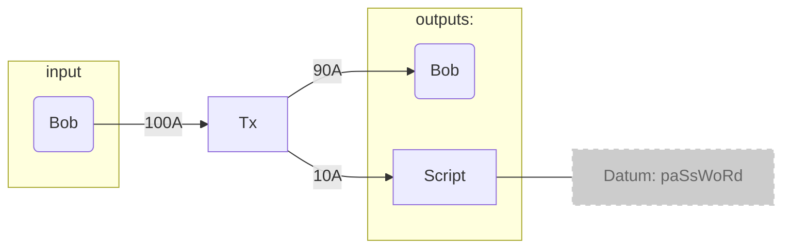
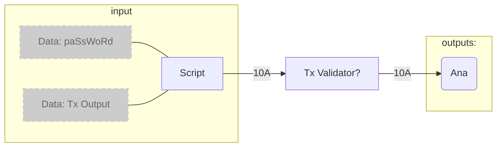
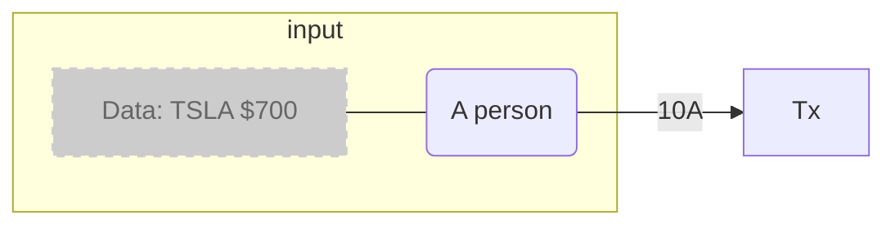

### Intro

##### Script sent to chain
Bob puts 10A on chain and gives a password to Ana to redeem it from the script

Bob makes a transaction with input his wallet and as output a script with the amount he wants to send to Ana and to his wallet with the change.



The script will hold a password as `datum`.

<br>
##### Redeem the ADA by the Validator script
Now when Ana wants to redeem the 10A, she would create a new transaction, this time with the script as input but with `data` included to validate that she can use the script. In our case the `data` would be the password that Bob gave Ana (the `redeemer` value), the output of the transaction would be an address associated with Ana wallet.
> Apparently we can't use an existing address to send ada from a script?



Every Plutus smart contract has the concept of On-Chain code and Off-Chain code.
Off-Chain code is the code that would build and send the transaction to the On-Chain code (residing on a Cardano node? or better on the blockchain?).
The On-Chain code is also known as the `Validator` script, which is what uses the `datum` and `redeemer` to figure out if the ADA should be released or not.

<br>

### Stock Price Guessing Game
The game consists in a person (A) guessing if a stock will be higher or lower in say 30 minutes, if they are right A will get the money but if they are wrong B will get the money.
A will lock up the ADAs that the want to bid and also the current stock price value.
B will try to guess if the stock price is higher or lower.
If B guesses correctly they will get the money, otherwise the ADAs will just remain locked in the contract.


Let's now breakup the problem with the On-Chain implementation and the Off-Chain implementation.
<br>
##### On-Chain Implementation - `Validator`
The On-Chain code, the `Validator`, needs a `Datum` and a `Redeemer` for its creation.
The `Datum` will be what person A sends to lock the `Data` and the stock price. Of course the ADA value is already part of the contract, so in reality this `Datum` will only be the stock price.
<br>
The `Redeemer` will be a logic that says: 
```js
    redeemerPrice > validatorPrice ? true : false
```
If the redeemer `bool` is true B gets the money otherwise if false the money stays in the contract.

<br>
##### Off-Chain Implementation - ``
This is the interface that the user interacts with to send the transactions to on-chain code.
Users will need to send specific parameters to this interface (endpoints) which then will be used to create set transactions.
How many endpoints for this interface? two:
1. A sending the locked value. Paramenters:
   - <s>ADAs bet</s>
   - Stock Value
2. B guessing if stock is higher or lower.
   - Bool: higher = true; lower = false.