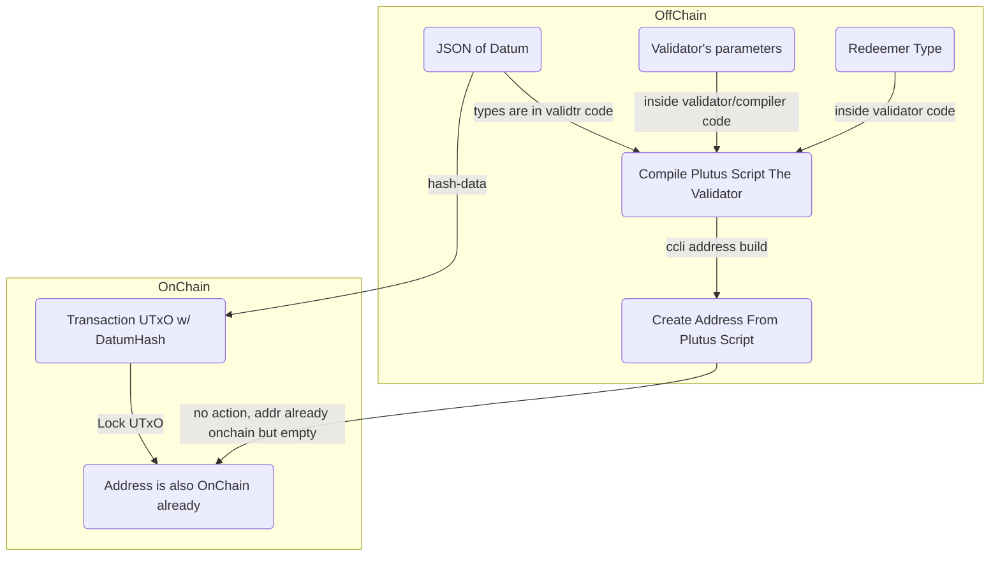

# Intro

## Script sent to chain

Bob puts 10A on chain and gives a password to Ana to redeem it from the script

Bob makes a transaction with input his wallet and as output a script with the amount he wants to send to Ana and to his wallet with the change.


The script will hold a password as `datum`.

<br>

## Redeem the ADA by the Validator script

Now when Ana wants to redeem the 10A, she would create a new transaction, this time with the script as input but with `data` included to validate that she can use the script. In our case the `data` would be the password that Bob gave Ana (the `redeemer` value), the output of the transaction would be an address associated with Ana wallet.
> Apparently we can't use an existing address to send ada from a script?


Every Plutus smart contract has the concept of On-Chain code and Off-Chain code.
Off-Chain code is the code that would build and send the transaction to the On-Chain code (residing on a Cardano node? or better on the blockchain?).
The On-Chain code is also known as the `Validator` script, which is what uses the `datum` and `redeemer` to figure out if the ADA should be released or not.

<br>

## Stock Price Guessing Game

The game consists in a person (A) guessing if a stock will be higher or lower in say 30 minutes, if they are right A will get the money but if they are wrong B will get the money.
A will lock up the ADAs that the want to bid and also the current stock price value.
B will try to guess if the stock price is higher or lower.
If B guesses correctly they will get the money, otherwise the ADAs will just remain locked in the contract.


Let's now breakup the problem with the On-Chain implementation and the Off-Chain implementation.

<br>

## On-Chain Implementation - `Validator`

The On-Chain code, the `Validator`, needs a `Datum` and a `Redeemer` for its creation.
The `Datum` will be what person A sends to lock the `Data` and the stock price. Of course the ADA value is already part of the contract, so in reality this `Datum` will only be the stock price.

<br>

The `Redeemer` will be a logic that says: 

```js
    redeemerPrice > validatorPrice ? true : false
```

If the redeemer `bool` is true B gets the money otherwise if false the money stays in the contract.

<br>

## Off-Chain Implementation - ``

This is the interface that the user interacts with to send the transactions to on-chain code.
Users will need to send specific parameters to this interface (endpoints) which then will be used to create set transactions.
How many endpoints for this interface? two:
1. A sending the locked value. Paramenters:
   - <s>ADAs bet</s>
   - Stock Value
2. B guessing if stock is higher or lower.
   - Bool: higher = true; lower = false.

# Validator

Interact with smart-contract all you do is build a specific sort of Tx that meet the requirement of the *validator* that is in the smart-contract.

The validator takes several parameters, i.e inputs, and produces a results which consists of says True or False. To be `True` all sub-conditions need to be `True`.
Validators are composed by three elements

```
Validator :: Datum -> Redeemer -> Context -> Bool
```

The validator may also contain one or multiple optional parameters, these will not fundamentally affect the function of the validator, but will create different validation scripts which in turn result in different script addresses.

When I start to write business logic inside plutus in for the validator that logic can check against what's seen in the redeemer and the datum. the difference is that datum is OnChain and the redeemer is not.

### metaphors:

Think of the contract address as a convenient store, the reddemer is often used as a statement of intent, like entering inside the store and say "I'd like to buy a candy bar" or "I'd like to rob you at the cash register" the value, the ada is my money and the datum is my loyalty card that gives me access to discounts at the store.

All the action in Cardano happens in transactions, the Validator is just a set of rules that can say only `True | False`.
There is then a terziary service (which can be of many types) that creates transactions that have to look after the fact those transactions need to have what it takes to deal with the validator.


## Datum

The datum is a required element of the validation process. In order to lock or unlock funds at a script address, the datum is required either in the form of a hash (locking) or a file (unlocking).

The datum can take an arbitrary data type, i.e. you can define it in the form

```haskell
data MyDatum = MyDatum 
    {
        var1 :: !PubKeyHash,
        var2 :: !Integer,
        -- .... ,
        varn :: !Integer
    }
```

the datum is going to be OnChain, correlated with the UTxO as if it was a native token, unlike the redeemer.

## Redeemer

The *redeemer* is also required when building a *validator*, but unlike the *datum* whose hash is compared to the *datum* held at the script prior to implementing the script validation process, **the redeemer could be set as an arbitrary value unless the validator expects it to be of a precise value**.

One key exception is that the `type` of the *redeemer*, e.g. `Integer` or `String`, may still be expected by the *validator*.
In this case if a `Integer` is expected, `23` may work, while `"23"` may not. 

The redeemer can't be store OnChain, but both datum and redeemer are referenceable inside you validator's code.

Can be also considered as a guide of the flow of the validation, is a gate keeping to gide the traffic, to see what can be done when the person has passed this gate.

## Context

The context is the set of information related to a transaction. This set can contain required and optional parameters. 

Common elements of the context include: the actors (users of the script - signatories), the inputs and outputs (containing both value and data - e.g: 20 Ada with a corresponding datum locked at a script), time of validation, etc.

The context is also used to increase the complexity of a validation script.




Important to notice here that from the same contract I will always get the same address. For instance the most basic plutus contract `mkValidator _ _ _ = ()` that is basicaly empty, if compiled and then checked on the UTxOs at its address, will surprisingly give back a lot of UTxOs because there is many people using it as a first test locking money in it. Because of Haskell determinism.

An *address* can receive any ADA from anybody. But who owns the *private keys* for that *address* can then unlock any ADA that was sent to him.
The *contract address* is similar, if you send value to that address, now it is locked there (when you do that you also have to include a **Datum** hash, which is in fact OnChain), but instead of a private key we have a *validator* that has a set of rules that if `True` will unlock the ADAs.To reiterate, the UTxOs in a *contract address* to be unlockable must have a **Datum** attached to them.
Withdrawing those values, using those UTxOs is qeuivalent to interacting with the contract. That's when a *validator* logic matters.

Can any action be triggered when sending a transaction to a *contract address*?
1. The right way to think of it is that you can have an off chain code to trigger some action. Let's have this service that watches the *contract address* and whenever a new UTxO hits it, let's watch the address of the sender, and let's send something to that address. 
2. Another way is to build transaction that have inputs to, and outputs from *contracts addresses*. one transaction for instance can unlock an UTxO and then send outputs to other smart contracts addresses (with relative **Datum**) even multiple of them.

## [Lock Funds to A Script Address](https://gimbalabs.instructure.com/courses/26/pages/204-dot-2-how-to-safely-lock-funds-at-a-script-address?module_item_id=1115)

After we compiled our plutus script - which includes validator, datum and possibly redeemer - we can create and address for our validator

```bash
cardano-cli address build --payment-script-file MyFirstValidator.plutus --testnet-magic 1097911063 --out-file first_val.addr
```

> [source code](https://gitlab.com/gimbalabs/plutus-pbl-summer-2022/ppbl-course-02/-/tree/master/project-204/src/Ppbl) of compiler and validator scripts.

As you can see in the source code the compiler script, when compiling the validator can use different parameters for the validator inputs, in particular we call them validator parameters. Those are the first inputs in the validator type.

```haskell
mkValidator :: PpblParameters -> PpblDatum -> PpblRedeemer -> ScriptContext -> Bool
```

In the compiler script there is a function that writes the validator script by first supplying a JSON for the parameters:

```haskell
writePpblScript :: IO (Either (FileError ()) ())
writePpblScript = writeValidator "src/Ppbl/output/MyFirstValidator.plutus" $ Ppbl.PpblValidator.validator $ PpblParameters
    {
      ownerAddress = "9c68b6455daa791d56ba1a5c33fbc9e30c92041947a74eb82589cbe7"
    , ownerCut     = 5000000
    }
```

We can now compile with the usual steps

```bash
$ cd /plutus-apps
$ nix-shell
[nix]$ cd /project
[nix]$ cabal clean; cabal update
[nix]$ cabal build
[nix]$ cabal repl
Prelude Ppbl.PpblCompiler> writePpblScript
Right ()
```

> Notice the line `exposed-modules:     Ppbl.PpblCompiler` in the `.cabal` file is what makes run the module when launching the repl.

In `src/Ppbl/output/MyFirstValidator.plutus`

```bash
{
    "type": "PlutusScriptV1",
    "description": "",
    "cborHex": "5910f65910f... ..."
}
```

We can now generate the script address

```bash
cardano-cli address build --payment-script-file MyFirstValidator.plutus --testnet-magic 1 --out-file first_val.addr

addr_test1wztrwcesed94w5xw86vrukdud0gydcjkmkuycyfqensn56ql9syxv
```


then we can change the `ownerCut` value and the path of the output file and run once again the compiler.
Then create a new script address for the newly created script which will have 1 different parameter.

```bash
cardano-cli address build --payment-script-file MySecondValidator.plutus --testnet-magic 1 --out-file second_val.addr

addr_test1wzprg3wgy2e22jqrxwdn7wx0xmzjxudezzy6ns4eazfnz2sxhqj7q
```

As you can notice just from that 1 different parameter the address changes. The two scripts will have two completely different containers.

Anyone can send funds at a script address as long as they include a datumhash. This essentially consist in sending funds to an address in the same way we send funds to friends' payment addresses. The distinction is thus between a payment and a script address. The former is the address from the wallet and it does not require a datumhash while the later is an address which is managed through a script's validator.

These two types of addresses share common features: staking possibilities and they are essentially composed of utxos.

Sending funds without a Datum Hash may lock your funds with no way of unlocking them. 

### Safely Lock Funds

1. Use a datumhash whose construction you can replicate. Depending on whether you use the Cli or a front-end, this requirement may or many not be trivial. When using the Cli, you send the Hash of a file you created and this file continues to exist even after you have submitted your transaction. However, when using a front-end, you may send a datum whose values are based on changing elements such as a timestamp.
2. Implement a redeemer requirement while validating your transactions. This will allow you to limit the consumption of utxos to a known set of venues. By implementing an increasingly complex redeemer, you improve the experience of the user while limiting the attack vectors of your application.
3. Require a known user to sign the transaction while consuming funds held at a script. Seldomly we allow random actors in any given circumstance. A soccer game is played by soccer players and not by fans and a game of chess is played by two actors. Often, the number and identity of actors are known.

for instance We used a combination of two conditions to lock our funds:
- Require the known signees (seller or buyer);
- Pre-allocate funds to known beneficiaries (owner of the script address, buyer and seller). 

You can see this in the Redeemer logic inside the validator's code.

We can now proceede to create our datum JSON file `PpblDatum.json`. In the script supplied from Ppbl there is a function to write the JSON.

```json
{
    "constructor":0,
    "fields":[
        {"bytes":"358b2dbffc561e85c8251af0b79534be44fdf049e66ef3e2f7aa9418"},
        {"bytes":"b3a5d1c826945b361a3c5236d84fd8dcbf66faa27ab10ef1535d9057"},
        {"int":20000000},
        {"int":5000000}
    ]
}
```

We can now create the datumhash from the JSON file.

```bash
cardano-cli transaction hash-script-data --script-data-file PpblDatum.json >> sale.hash

c9c310f057d7cef9c523c9b5447efa4d8d0db597d88412af6f82e2984198c57d
```

We'll use this Datumhash to send with the transaction to the script address while locking the funds.

```bash
cardano-cli transaction build /
    --testnet-magic 1 /
    --tx-in $txhash#$txix /
    --tx-out $s_address+$s_output /
    --tx-out-datum-hash c9c310f057d7cef9c523c9b5447efa4d8d0db597d88412af6f82e2984198c57d /
    --change-address $address /
    --out-file tx.raw

# s_address and s_output refer to the script address and the amount we send
# address is our own payment.addr

cardano-cli transaction sign /
    --signing-key-file payment.skey /
    --testnet-magic 1 /
    --tx-body-file tx.raw /
    --out-file tx.signed

cardano-cli transaction submit /
    --tx-file tx.signed /
    --testnet-magic 1
```

## [UnLock eUTxO from Contract Script Address](https://gimbalabs.instructure.com/courses/26/pages/204-dot-3-unlocking-a-eutxo-from-a-contract-script-address?module_item_id=1117)

### Redeemer

```haskell
data PpblRedeemer = Update | Buy | Cancel 
  deriving Show

PlutusTx.makeIsDataIndexed ''PpblRedeemer [('Update, 0), ('Buy, 1), ('Cancel, 2)]
PlutusTx.makeLift ''PpblRedeemer
```

This is a [template haskel quatation](https://downloads.haskell.org/ghc/latest/docs/users_guide/exts/template_haskell.html#template-haskell) [and more](https://wiki.haskell.org/Template_Haskell).
It is used to create the redeemer when we are actually trying to redeem our smart contract UTxOs. In this case the redeemers values don't have parameters so it is simpler to create the JSON used as a redeemer to unlock the funds.
Here it is how we write the redeemer to use in the unlocking transaction

```json
{
    "constructor":2,
    "fields":[]
}
```

So in this case we are going to `Cancel`, if we wanted to `Update` we would have used `"constructor":0` and for `Buy` `"constructor":1`. 


```bash
s_address= #"the script address"
address= #"my/user address"
b_address= #"buyer address, was in the datum at LOCKing time"
m_address= #"market owner address"
m_output=3000000 #"market owner cut"
txhash= #"hash of the UTxO we are going to use from script address"
txix= #"index of the UTxO"
txhashcollaral= #"hash of the UTxO we are going to use for collateral"
txixcollateral= #"index of the UTxO"
seller_hash= #"was in the datum at LOCKing time (I think same as address, but an hash)"
```

The collateral is paid if the transaction fails.


```bash
cardano-cli transaction build /
    --testnet-magic 1 /
    --tx-in $txhash#$txix /
    --tx-in-script-file MyFirstValidator.plutus /
    --tx-in-datum-file PpblDatum.json /
    --tx-in-redeemer-file redeemer.json /
    --tx-in-collateral $txhashcollateral#$txixcollateral / 
    --required-signer-hash $seller_hash /
    --tx-out $m_address /
    --tx-out $b_address+5000000 /
    --change-address $address /
    --protocol-params-file protocol.json /
    --out-file tx_cs.body
```

```bash
cardano-cli transaction sign /
    --signing-key-file payment.skey /
    --testnet-magic 1 /
    --tx-body-file tx_cs.body /
    --out-file tx_cs.signed
```

```bash
cardano-cli transaction submit /
    --tx-file tx_cs.signed
    --testnet-magic 1
```

If you look at the `Cancel` case

```haskell
-- ...
Cancel     ->   traceIfFalse "Only Seller can Cancel Sale"                          signedBySeller  &&
                traceIfFalse "Cut Paid to Market Owner"                             cutToOwner &&
                traceIfFalse "Buyer should paid the Cancellation the exact Fee"     feesToBuyer
-- ...
```

First we can see that ther are three conditions that have to be `True` for the script to succeede. For instance if we give a the wrong value in the `--tx-out $b_ddress+30000` we would get an error `"Buyer should paid the Cancellation the exact Fee"`.

In the definition of `feesToBuyer`

```haskell
feesToBuyer :: Bool
feesToBuyer = (getLovelace $ fromValue valueToBuyer) >= (cancelFees dat)
```

we can see that we get the lovelace value from the value sent to the buyer which needs to be larger or equal to the cancellation fee set in the datum.

The `--required-signer-hash $seller_hash /` I think just binds the hash of the address that will sign the transaction to the address we want to approve the transaction, in this case the seller. Indeed from the tutorial wasn't clear but I think that `$seller_hash` is from the same address of `$address` that comes from the `payment.skey` used durign signing.
